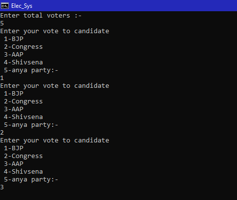
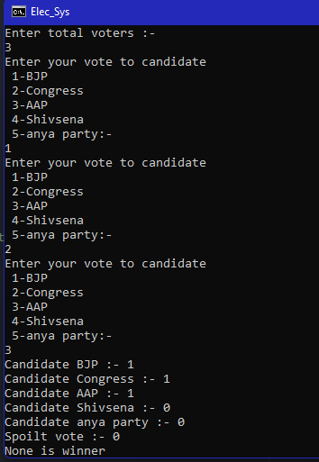

In this program first it takes number people who will vote, as a input. Then each people have to 
vote to a party they want to from the displayed list then program will calculate the votes and 
shows the result

Input:

Output:

