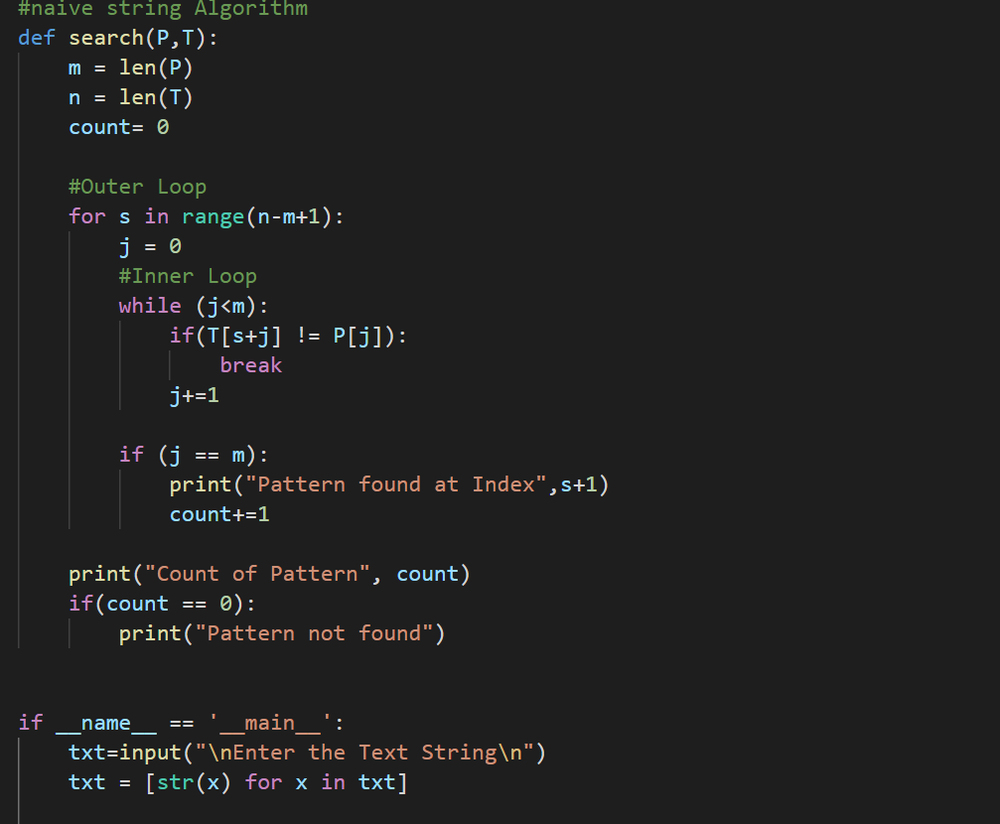
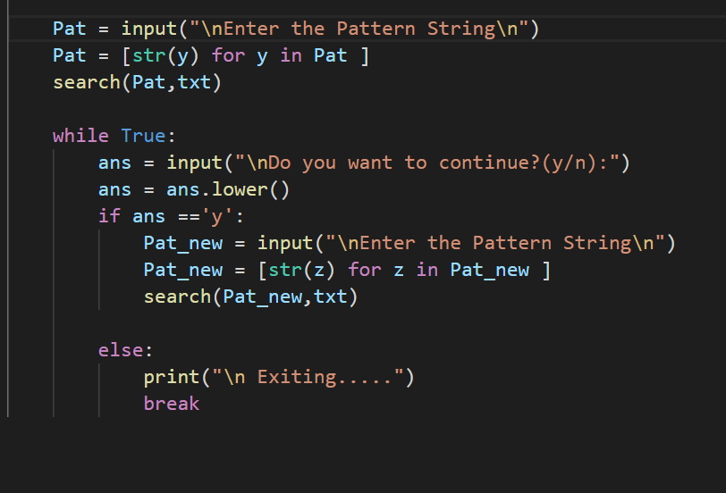
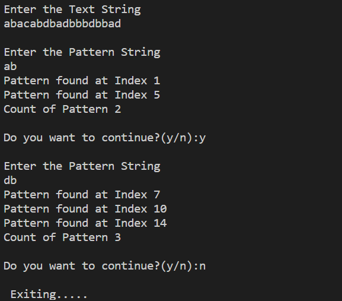

NAIVE STRING ALGORITHM:-

Its a string Matching Algorithm:-

It will check for The pattern in the given text.
It will find more then one occurrence of pattern in a text:-

In this i have given TEXT:-
								abbabddababddab
											
					 Pattern:-  ab

Input:-

 
 Output:-

 
 
 

